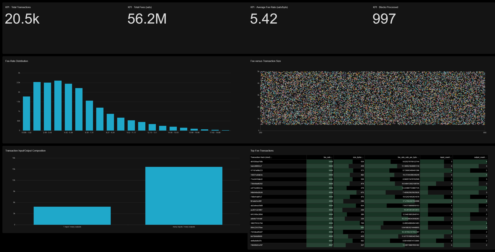

# Blockchain Analytics Pipeline

## About

This project is a local, end-to-end data engineering demonstration: synthetic
Bitcoin-style CSV data is generated, ingested through Bronze and Silver
validation/reconciliation layers, published as Gold Iceberg tables, queried
through Trino, and visualized in Apache Superset.

The synthetic generator makes the workflow repeatable without relying on an
external blockchain feed or exposing real transaction data. It produces linked
blocks, transactions, inputs, and outputs over a controllable time range, and
can introduce deterministic quality and relationship errors. That makes it
possible to demonstrate normal ingestion, reject handling, UTXO reconciliation,
and Gold-layer analytics from a clean local setup.

## Synthetic Data

### Data Generation

The scripts in [`data/`](data/) generate the Raw-layer CSV deliveries used by
the pipeline:

- [`generate.py`](data/generate.py) builds a clean, linked block/transaction
  dataset in `data/raw/ingest_<YYYY-MM-DD>/`.
- [`generate_corrupt.py`](data/generate_corrupt.py) first builds the same
  baseline, then applies a selected fixture from
  [`corrupt_fixture.py`](data/corrupt_fixture.py) and writes to
  `data/raw/corrupt_ingest_<YYYY-MM-DD>/`.

Use the clean generator for the normal batch flow:

```bash
python data/generate.py --transactions 20000 --genesis-utxos 10000
make ingest-batch BATCH=<YYYY-MM-DD>
```

The generator creates exactly the requested number of transactions, groups
them into variable-size blocks, advances block time by 8–12 minutes, and spends
from an in-memory UTXO set. If it exhausts spendable outputs, increase
`--genesis-utxos` or generate more outputs. A seed makes the random simulation
choices repeatable, but UUID-derived hashes and identifiers mean files are not
byte-for-byte reproducible across runs.

The corrupt generator is intended to exercise validation and reconciliation
paths. Its output directory is deliberately distinct and is not consumed by
the current `make ingest-batch` convention without renaming or copying it to
an `ingest_<YYYY-MM-DD>` directory.

See [Synthetic Data Generation](docs/data_generation.md) for script options,
output behavior, and UTXO-generation details, and
[Corruption Fixtures](docs/corruption_fixtures.md) for the controlled failure
scenarios.

### Data Model

The generator models a simplified, internally consistent Bitcoin-style
transaction graph across four CSV files. A block contains transactions; each
transaction has one or more inputs and outputs; and a non-genesis input refers
to a prior output by `(previous_tx_hash, previous_output_index)`.

| Entity | Grain | Primary relationship |
| --- | --- | --- |
| `blocks.csv` | One block | `block_hash` identifies a block. |
| `transactions.csv` | One transaction | `block_hash` links a transaction to its block. |
| `inputs.csv` | One transaction input | `tx_hash` links to its spending transaction; previous-output fields model the UTXO spend. |
| `outputs.csv` | One transaction output | `tx_hash` links to its creating transaction. |

Values are expressed in satoshis, and clean records obey
`total_input_sats = total_output_sats + fee_sats`. The generator uses the
`genesis` sentinel for seeded inputs that have no prior generated output.

See [Synthetic Data Model](docs/synthetic_data_model.md) for field-level
definitions, examples, and the relationship diagram.

## Shared Iceberg Catalog

The local stack uses a Hive Metastore backed by PostgreSQL as the shared
Iceberg catalog. Spark continues to store table data and Iceberg metadata under
`warehouse/`, while the metastore records table and namespace registrations.

Start the stack with:

```bash
docker compose up -d --build
```

## Batch ingestion

Once a raw delivery exists at `data/raw/ingest_<YYYY-MM-DD>/` with the four
CSV files (`blocks`, `transactions`, `inputs`, and `outputs`), run the entire
pipeline with:

```bash
make ingest-batch BATCH=2026-08-18
```

The batch runner verifies that every input file is present, ingests all bronze
datasets, then runs the dependent silver jobs (including UTXO reconciliation),
and only then creates the gold datasets. It exits immediately on a failure, so
no downstream layer begins after an unsuccessful upstream job.

The current silver and gold jobs process the full upstream tables and replace
their target tables; therefore this command is a safe full refresh of curated
layers, not yet an incremental per-batch silver/gold pipeline.

A one-shot Compose service aligns the bind-mounted `warehouse/` directory with
the non-root Spark container user before Spark starts.

The ingestion jobs create the `bronze`, `silver`, `silver_rejects`, and `gold`
namespaces automatically. With a new or empty warehouse, rerun the existing
bronze, silver, reconciliation, and gold jobs to repopulate the tables.

The metastore endpoint is available at `thrift://localhost:9083` for local
debugging.

## Spark Jobs

The Spark jobs in [`spark/`](spark/) implement the Bronze → Silver → Gold
pipeline. Bronze jobs load the raw CSV files with batch metadata; Silver jobs
validate and normalize records, retain rejects, and reconcile UTXOs; Gold jobs
produce the analysis-ready transaction, block, input, and output tables used by
Trino and Superset.

`make ingest-batch` runs the dependency order for a delivery. Individual jobs
can also be submitted to the local Spark cluster with `run.sh`:

```bash
./run.sh bronze ingest_blocks 2026-08-18
./run.sh silver reconcile_utxos
./run.sh gold ingest_transactions
```

Bronze jobs require a `YYYY-MM-DD` batch ID; Silver and Gold jobs operate on
the existing Iceberg tables and do not take one.

See [Data Transformations](docs/data_transformations.md) for the implemented
rules, reconciliation outputs, and Gold-table purpose by layer.

## Trino Query Layer

Trino exposes the shared Iceberg catalog for read-only SQL queries at
[http://localhost:8082](http://localhost:8082). Run `docker compose exec trino
trino` to open its CLI, then query tables such as `iceberg.gold.transactions`.


## Apache Superset

Apache Superset is available at [http://localhost:8088](http://localhost:8088).
For local defaults, sign in as `admin` with password `admin`; copy `.env.example`
to `.env` to set non-default local credentials before first startup. The
initialization job registers the shared `iceberg` catalog as `Trino Iceberg`
using `trino://superset@trino:8080/iceberg`.

The `superset-bootstrap` job then runs automatically after Superset
initialization and Trino are ready. Its scripts in
[`superset/bootstrap/`](superset/bootstrap/) register the four Gold datasets,
their metrics and calculated columns, the transaction-analysis charts, and the
**Bitcoin Transaction Activity** dashboard. The bootstrap is idempotent, so it
updates those same Superset objects on subsequent runs.



### Potential visualization expansions

The current bootstrap focuses on transaction activity and its core KPI,
distribution, composition, scatter, and detail-table views. Follow-on work
could add a daily transaction/fee trend and a native date filter to this
dashboard.

A separate **Pipeline Reconciliation and UTXO Quality** dashboard could use
the existing Gold Inputs and Gold Outputs datasets to show UTXO resolution
status, source-versus-canonical spent-state discrepancies, double-spend counts,
and output time-to-spend distribution. The proposed visualization roadmap is
available in [Superset Visualization Roadmap](docs/superset_visualization_roadmap.md).
